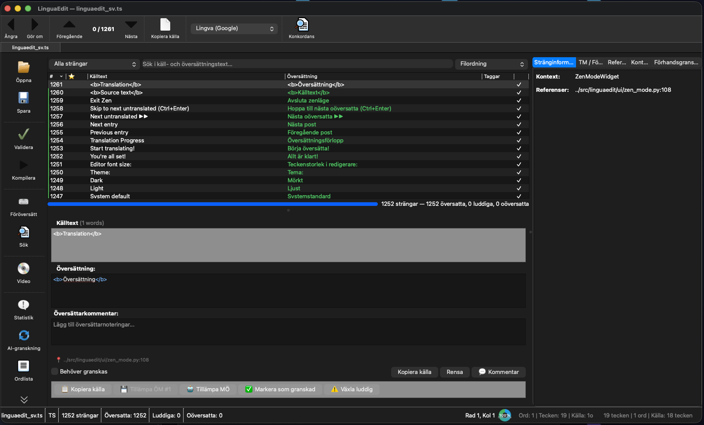
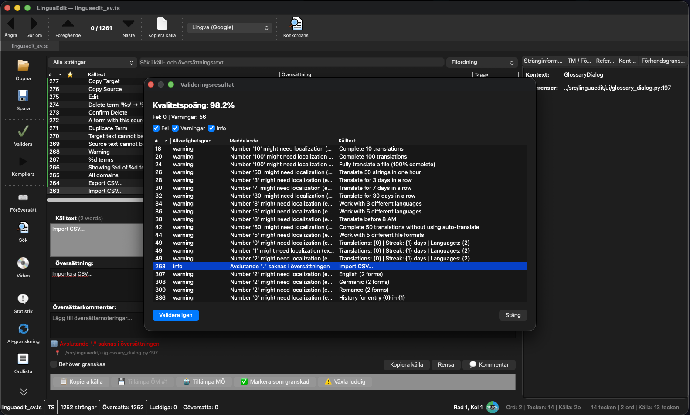
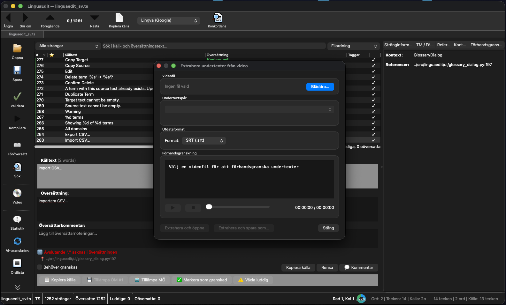
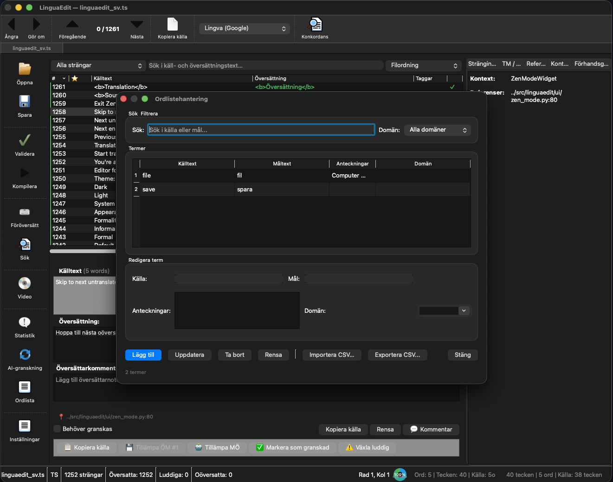

# LinguaEdit


**Professional translation editor built with PySide6/Qt6 — by a translator, for translators.**

LinguaEdit is a feature-rich, cross-platform translation editor that supports 17+ file formats, translation memory, AI-powered review, and a modern UI designed for productive translation workflows.

🌐 **Website:** [www.linguaedit.org](https://www.linguaedit.org)
📦 **Releases:** [GitHub Releases](https://github.com/yeager/linguaedit/releases)
📝 **Changelog:** [CHANGELOG.md](CHANGELOG.md)
🐛 **Issues:** [GitHub Issues](https://github.com/yeager/linguaedit/issues)

---

## 📸 Screenshots

### Main Editor


### Translation Engines


### Validation


### Statistics


### Video Subtitle Extraction


### Glossary Management


---

## 📦 Installation

### pip / pipx (recommended)

```bash
# Install with pipx (isolated environment)
pipx install linguaedit

# Or with pip
pip install linguaedit

# Run
linguaedit-gui
```

### Debian / Ubuntu

```bash
# Add repository
curl -fsSL https://yeager.github.io/debian-repo/yeager-repo.gpg | sudo gpg --dearmor -o /usr/share/keyrings/yeager-repo.gpg
echo "deb [signed-by=/usr/share/keyrings/yeager-repo.gpg] https://yeager.github.io/debian-repo stable main" | sudo tee /etc/apt/sources.list.d/yeager.list

# Install
sudo apt update
sudo apt install linguaedit

# Note: PySide6 is not available as a system package on most distros.
# Install it via pip:
pip install PySide6
```

### Fedora / RHEL / openSUSE

```bash
# Add repository
sudo dnf config-manager --add-repo https://yeager.github.io/rpm-repo/yeager.repo

# Install
sudo dnf install linguaedit

# Install PySide6:
pip install PySide6
```

### macOS

```bash
# Via pipx
pipx install linguaedit

# For proper menu bar name and file associations,
# download LinguaEdit.app from GitHub Releases
```

### Windows

Download the self-contained `.exe` from [GitHub Releases](https://github.com/yeager/linguaedit/releases) — no Python installation required.

---

## ✨ Features

### 📄 17+ File Formats

| Format | Extensions | Notes |
|--------|-----------|-------|
| **PO / POT** | `.po`, `.pot` | GNU Gettext |
| **Qt Linguist** | `.ts` | XML format |
| **XLIFF** | `.xliff`, `.xlf` | Version 1.2 & 2.0 |
| **SDLXLIFF** | `.sdlxliff` | Trados with segment definitions |
| **MQXLIFF** | `.mqxliff` | memoQ with namespace detection |
| **JSON** | `.json` | Flat & nested i18n |
| **YAML** | `.yml`, `.yaml` | i18n files |
| **Android XML** | `.xml` | strings.xml |
| **ARB** | `.arb` | Flutter Application Resource Bundle |
| **PHP** | `.php` | Array format |
| **Java Properties** | `.properties` | Key=value |
| **Apple Strings** | `.strings` | Localizable.strings |
| **Unity Asset** | `.asset` | Unity localization |
| **RESX** | `.resx` | .NET resource files |
| **Chrome i18n** | `.json` | messages.json |
| **Godot** | `.tres` | Godot translation resources |
| **Subtitles** | `.srt`, `.vtt` | SubRip & WebVTT |
| **TMX** | `.tmx` | Translation Memory eXchange |

### 🔍 Editor & Navigation

- **Multi-tab editing** — work on multiple files simultaneously
- **Smart search & replace** with regex, case sensitivity, whole word
- **Status filters** — All, Untranslated, Fuzzy, Translated, Reviewed, With Warnings
- **Sort modes** — File order, alphabetical, by length, untranslated first, by reference
- **Inline editing** — double-click entries in the list
- **Drag & drop** files to open
- **Bookmarks** — star entries for quick access
- **Tags** — organize entries with custom tags
- **Minimap** — visual overview of file status

### 🧘 Zen Translation Mode

Distraction-free translation workflow (Ctrl+Shift+Z):
- Source text (read-only) + translation (editable)
- Progress bar at top
- Tab = save + next untranslated
- Escape = exit Zen mode

### ⌨️ Keyboard Shortcuts

| Shortcut | Action |
|----------|--------|
| `Ctrl+O` | Open file |
| `Ctrl+S` | Save |
| `Ctrl+H` | Search & Replace |
| `Ctrl+U` | Toggle fuzzy |
| `Alt+Enter` | Next untranslated |
| `Ctrl+Shift+↑/↓` | Previous/next fuzzy |
| `Ctrl+Enter` | Copy source to translation |
| `Tab` | Save + next entry |
| `Shift+Tab` | Save + previous entry |
| `Ctrl+Shift+Z` | Zen Mode |
| `Ctrl+D` | Project Dashboard |
| `Ctrl+Shift+D` | Git Diff |
| `Ctrl+Alt+T` | Batch Translate |
| `Ctrl+Shift+F` | Focus Mode (untranslated only) |
| `F11` | Fullscreen |
| `Ctrl+R` | Run linter |
| `Ctrl+Shift+A` | AI Review |

### 🧠 Translation Memory (TM)

- SQLite-based, zero configuration
- Fuzzy matching with configurable threshold
- Auto-learning from your translations
- Autocomplete suggestions while typing
- Import/export TMX files
- Propagate identical translations across entries

### 📖 Glossary

- Term management with source → target pairs
- Domain tagging
- Consistency checking across the project
- Import/export CSV
- Real-time term highlighting in editor

### 🤖 AI & Machine Translation

- **Inline MT suggestions** — DeepL/OpenAI suggestions appear as you translate
- **Batch Machine Translate** (Ctrl+Alt+T) — translate all untranslated at once
- **AI Review** (Ctrl+Shift+A) — quality scoring with heuristic fallback
- **Back-translation verification** — detect meaning drift
- **Confidence scores** per entry with visual indicators
- Supported engines: DeepL, OpenAI, Google, Lingva, MyMemory

### ✅ Quality Assurance

- **15+ linting checks:**
  - Missing translations
  - Placeholder/format string mismatches (`%s`, `{0}`, etc.)
  - HTML/XML tag mismatches
  - Accelerator key mismatches (`&`)
  - Length ratio warnings
  - Duplicate translations
  - Case mismatches
  - CLDR plural form validation
  - Number localization (thousands separator, currency, dates)
  - Inconsistent translations
  - Trailing whitespace/punctuation
- **Spell check** — red wavy underlines with suggestions and custom dictionary
- **Regex tester** — validate format strings
- **Layout simulator** — pixel width checking for UI text
- **Unicode inspector** — detect invisible/suspicious characters

### 📊 Project Dashboard (Ctrl+D)

- Per-language translation progress bars
- Pie chart and bar chart (QPainter-based, no external deps)
- Total string counts and summary stats
- Export statistics as CSV

### 🔀 Git Integration

- **Git Diff** (Ctrl+Shift+D) — compare with previous commits
- Detect outdated translations (source changed, translation didn't)
- Stage, commit, branch management from within the editor
- File change monitoring with auto-reload

### 🎬 Video Subtitle Translation

- **FFmpeg integration** — extract subtitles from video files (.mkv, .mp4, .avi, etc.)
- **Auto video preview** — opening a .srt/.vtt automatically finds and shows the matching video
- **Editable timestamps** — time intervals as a dedicated column
- **Progress bar** during extraction with percentage
- User-friendly dialog when FFmpeg is not installed

### 🔐 Security

- **Cross-platform credential storage:**
  - macOS: Keychain
  - Windows: Credential Locker
  - Linux: Secret Service (GNOME Keyring / KWallet)
  - Fallback: AES-encrypted file with master password (PBKDF2, 480k iterations)
- Security status visible in Preferences → Security

### 🌐 Platform Integration

- **Weblate / Crowdin / Transifex** — sync projects, pull/push translations
- **File associations** — double-click `.po`, `.ts`, `.xliff`, etc. to open (macOS + Linux)
- macOS `.app` bundle with proper menu bar name and icon
- Linux `.desktop` file with MIME type definitions

### 🎨 Themes & UI

- **5 built-in themes** including comprehensive dark mode
- **Horizontal/vertical layout toggle** — editor on right or below
- **Auto-collapsing side panel** — hides when empty
- **Context-aware toolbar** — customizable, with overflow menu
- **Colored entry borders** — red (untranslated), orange (fuzzy), green (translated)
- **Save flash animation** — green border flash confirming save
- Fullscreen mode (F11)
- Syntax highlighting for HTML tags, format strings, escape sequences

### 🧪 Testing

- **90 unit tests** covering parsers, linter, TM, settings, and security

### 🛠️ Advanced Tools

- **Macro recording** — record and replay translation actions
- **Plugin system** — extend functionality
- **Gamification** — achievements and streaks
- **Pomodoro timer** — built-in focus timer
- **TTS** — hear translations read aloud
- **OCR** — extract text from images
- **Locale map** — visual overview of project languages
- **Burndown charts** — track translation progress over time
- **QA profiles** — configurable validation rule sets

---

## 🇸🇪 Translations

LinguaEdit is currently translated to:
- **Swedish** — 100% (1023 strings)

Want to add your language? See [translations/README.md](translations/README.md) for instructions. Contributions via Pull Request are welcome!

---

## 🏗️ Building from Source

```bash
# Clone
git clone https://github.com/yeager/linguaedit.git
cd linguaedit

# Install in development mode
pip install -e .

# Run
linguaedit-gui

# Compile translations
pyside6-lrelease translations/linguaedit_sv.ts -qm translations/linguaedit_sv.qm
```

### Dependencies

- Python 3.10+
- PySide6 >= 6.5
- Optional: `ffmpeg` (video subtitle extraction), `hunspell` (spell checking)

---

## 📦 Package Repositories

### Debian/Ubuntu (apt)
```
deb [signed-by=/usr/share/keyrings/yeager-repo.gpg] https://yeager.github.io/debian-repo stable main
```

### RPM (dnf/yum)
```
https://yeager.github.io/rpm-repo/
```

See [debian-repo](https://github.com/yeager/debian-repo) and [rpm-repo](https://github.com/yeager/rpm-repo) for setup instructions.

---

## 📄 License

GPL-3.0-or-later — see [LICENSE](LICENSE).

---

## 👤 Author

**Daniel Nylander** — Dedicated contributor to Swedish open-source localization, with translations of Ubuntu, GNU binutils, Ardour, util-linux, Weblate, and many more projects.

- 🌐 [danielnylander.se](https://www.danielnylander.se)
- 🐙 [github.com/yeager](https://github.com/yeager)
