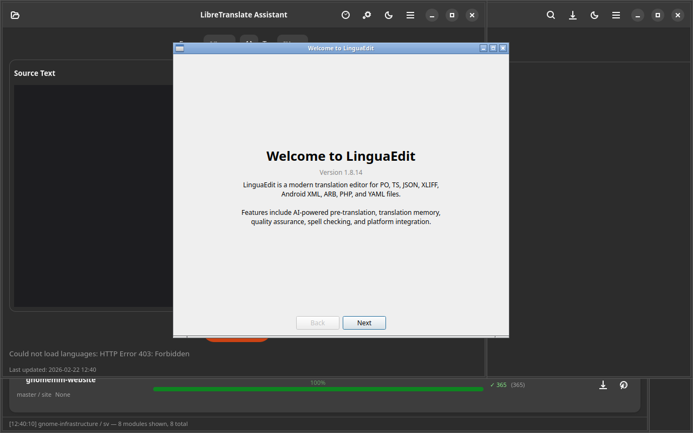

# LinguaEdit

Translation file editor for PO, TS, XLIFF, JSON, YAML, Android XML, ARB, and PHP files. Built with Qt6/PySide6.

Built with Qt6/PySide6. Part of the [Danne L10n Suite](https://github.com/yeager/debian-repo).

## Installation

### Debian/Ubuntu
```bash
sudo apt install linguaedit
```

### Fedora/RPM
```bash
sudo dnf install linguaedit
```

## License

GPL-3.0

## Author

Daniel Nylander — [danielnylander.se](https://danielnylander.se)

## Screenshots



