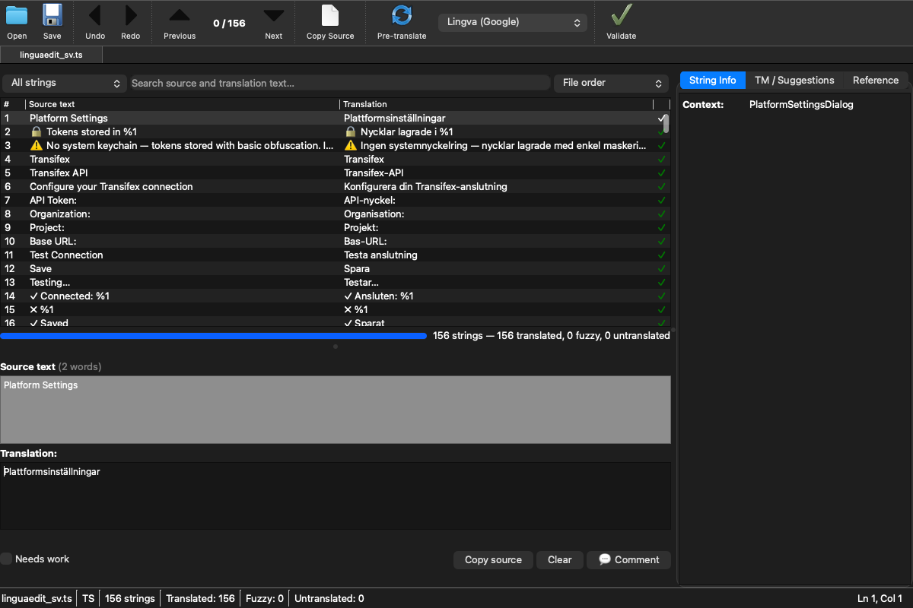

# LinguaEdit

A Qt6/PySide6 translation file editor for **PO**, **TS**, **JSON**, **XLIFF**, **Android XML**, **ARB**, **PHP**, and **YAML** i18n files.




## Features

- **Multi-format editing** — PO/POT (gettext), Qt TS (XML), JSON (flat & nested), XLIFF 1.2/2.0, Android XML (strings.xml), Flutter ARB, PHP arrays, YAML
- **Tabbed editing** — open multiple files in tabs simultaneously
- **Inline linting & quality score** — format specifier checks, whitespace, length ratio, punctuation
- **QA profiles** — configurable quality assurance rule sets (formal, casual, strict)
- **Pre-translation** — Lingva, MyMemory (free); OpenAI, Anthropic (paid)
- **Translation memory** — fuzzy lookup from previously translated entries
- **Glossary manager** — maintain project glossaries with term enforcement
- **Spell checking** — via PyEnchant with configurable language
- **Translation reports** — generate HTML/CSV summary reports with statistics
- **Git integration** — view file status, diffs, and staged changes
- **Column sorting** — click headers to sort by source, translation, or status
- **Diff viewer** — side-by-side comparison of changes
- **Search & filter** — filter entries by text, status, or lint issues
- **Batch translation** — pre-translate all untranslated entries at once
- **Drag-and-drop** — open files by dropping them on the window
- **Recent files** — quick access to last 20 opened files
- **Keyboard shortcuts** — Ctrl+S save, Ctrl+O open, Ctrl+F find, and more
- **Metadata viewer** — Last-Translator, PO-Revision-Date, language, etc.
- **Plural form editing** — full support for nplurals
- **Comment editing** — translator comments per entry
- **Character & word count** — live display in status bar
- **Dark/light theme** — follows system preference or manual toggle
- **Icon toolbar** — Open, Save, Undo, Redo, Previous, Next, Copy Source, Pre-translate, Validate — with icons and text labels
- **App logo** — custom SVG/PNG icon for window and About dialog

### Platform Integration

- **GitHub PR workflow** — fetch POT, create branch, push translation, open PR
- **Transifex** — pull/push resources via API v3
- **Weblate** — pull/push translations via REST API
- **Crowdin** — pull/push files via API v2
- **Secure keystore** — API keys stored in platform keyring (libsecret / macOS Keychain)

### In-app Updates

Automatic update checking on macOS and Windows.

## Requirements

- Python 3.10+
- PySide6 (Qt 6)

### macOS

```bash
brew install enchant
pip install PySide6
```

### Linux (Ubuntu/Debian)

```bash
sudo apt install libenchant-2-dev
pip install PySide6
```

### Linux (Fedora)

```bash
sudo dnf install enchant2-devel
pip install PySide6
```

## Installation

```bash
pip install -e .

# With AI translation support:
pip install -e ".[ai]"
```

### Pre-built packages

- **macOS** — download `LinguaEdit-0.4.0-macOS.zip` from [Releases](https://github.com/yeager/linguaedit/releases)
- **Linux (.deb)** — available from [Yeager's APT repo](https://yeager.github.io/debian-repo/)
- **Windows** — build from source or use GitHub Actions artifacts

## Usage

```bash
# Launch GUI
linguaedit

# Open a file directly
linguaedit path/to/file.po
```

## Project Structure

```
linguaedit/
├── src/linguaedit/
│   ├── app.py              # Application entry point (PySide6)
│   ├── ui/
│   │   ├── window.py       # Main Qt window
│   │   ├── welcome_dialog.py
│   │   ├── preferences_dialog.py
│   │   ├── platform_dialog.py
│   │   └── sync_dialog.py
│   ├── parsers/
│   │   ├── po_parser.py    # PO/POT parser
│   │   ├── ts_parser.py    # Qt TS parser (XML)
│   │   ├── json_parser.py  # JSON i18n parser
│   │   ├── xliff_parser.py # XLIFF 1.2/2.0 parser
│   │   ├── android_parser.py # Android strings.xml parser
│   │   ├── arb_parser.py   # Flutter ARB parser
│   │   ├── php_parser.py   # PHP array parser
│   │   └── yaml_parser.py  # YAML i18n parser
│   └── services/
│       ├── linter.py       # Translation linting & quality score
│       ├── translator.py   # Pre-translation engines
│       ├── spellcheck.py   # Spell checking (enchant)
│       ├── github.py       # GitHub PR workflow
│       ├── platforms.py    # Transifex, Weblate, Crowdin
│       ├── keystore.py     # Secure API key storage
│       ├── tm.py           # Translation memory
│       ├── updater.py      # In-app update checker
│       ├── glossary.py     # Glossary manager
│       ├── qa_profiles.py  # QA profile engine
│       ├── report.py       # Translation reports
│       └── git_integration.py # Git status & diff
├── translations/           # Qt .ts/.qm translation files
├── docs/                   # Documentation
└── pyproject.toml
```

## License

GPL-3.0-or-later — see [LICENSE](LICENSE)

## Support / Donate

- [GitHub Sponsors](https://github.com/sponsors/yeager)
- 🇸🇪 Swish: +46702526206

## Author

Daniel Nylander <po@danielnylander.se>
